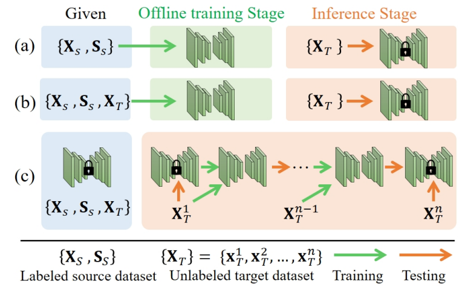
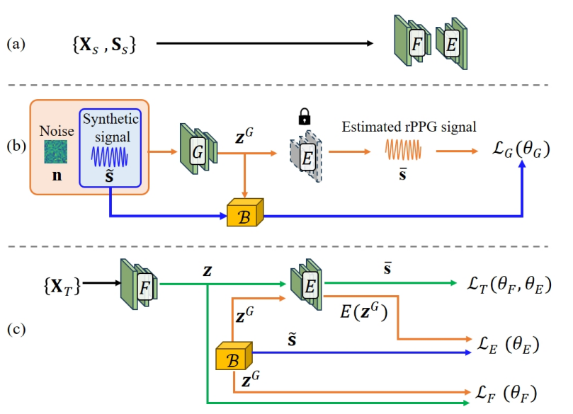

# TTA-rPPG
### Fully Test-Time rPPG Estimation via Synthetic Signal-Guided Feature Learning

## Illustration of different cross-domain scenarios.
<!--  -->

## Architecture of TTA-rPPG
<!--  -->

## Prerequisite
Please check `requirement.txt` for the required Python libraries.

## Training & Testing
Please make sure your dataset is processed and modify the code in `dataloader.py`, `train.py` and `test.py`.
Once the code is updated, you can run `train_tent.sh` directly to start training and testing."
